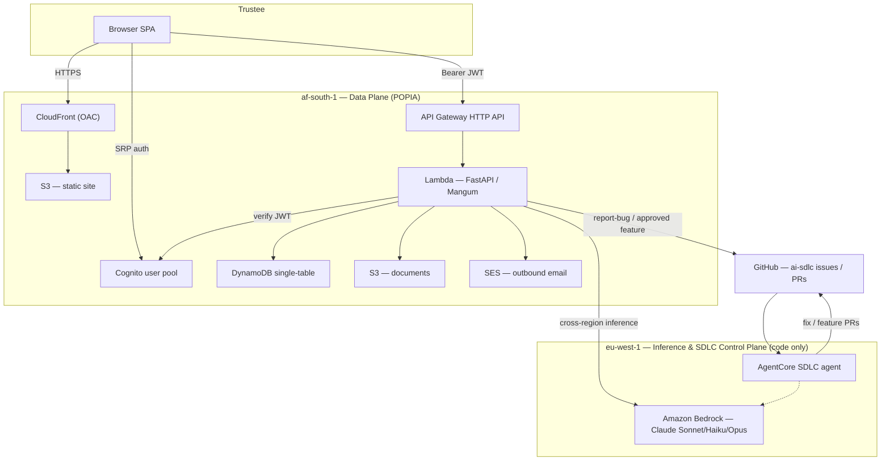

# Sectional Title AI Agent Platform

> An AI-native, autonomous operations platform for sectional-title / body-corporate
> trustees in South Africa — inbound email triage, AI-drafted replies with
> human-in-the-loop approval, a resolutions register, a task board, and a
> document brain (RAG Q&A) — built on AWS and designed for POPIA data residency.

<!-- Replace the placeholder badges below with your real CI / release / license URLs. -->

[](.github/workflows/ci.yml)
[](.github/workflows/supply-chain.yml)
[](https://www.conventionalcommits.org)
[](#license)
[](#security--compliance)

**Live demo:** https://d2vcnwv2hywkdo.cloudfront.net

---

## What is this?

Sectional-title trustees in South Africa run a body corporate as volunteers:
they triage a constant stream of email from owners, tenants, the managing agent,
contractors, CSOS and auditors; draft replies and circulars; track resolutions
and maintenance tasks; and stay compliant with the Sectional Titles Schemes
Management Act and CSOS rules — all without staff.

This platform absorbs that operational admin. It is a **trustees-only** web
application backed by a **team of AI capabilities** that ingest correspondence,
ground their reasoning in the scheme's own documents, and draft actions — while a
**human approves at the boundary that matters**. Nothing is sent on a trustee's
behalf without explicit sign-off.

The repository is also **AI-native in its own delivery**: captured runtime errors
and approved feature requests are filed as labelled GitHub issues that feed an
autonomous SDLC agent which opens fix and feature pull requests — all behind the
same strict, non-bypassable CI gates that protect the product.

> **Scope:** a single scheme, trustees-only logins; every other party
> (owners, tenants, managing agent, contractors) interacts by **email only**.
> See [docs/VISION_AND_REQUIREMENTS.md](docs/VISION_AND_REQUIREMENTS.md).

---

## Key features

| Capability                        | What it does                                                                                                                                                | Status                        |
| --------------------------------- | ----------------------------------------------------------------------------------------------------------------------------------------------------------- | ----------------------------- |
| **Inbox triage**                  | Classifies inbound email; chair "TASK:" emails open board tickets, everything else becomes a guardrailed reply **draft**.                                   | ✅ Built                      |
| **AI-drafted replies + approval** | Drafts a grounded response; trustee edits, approves, or discards. Approved replies are sent (SES) or filed; governance guardrails can block an unsafe send. | ✅ Built                      |
| **Resolutions register**          | Filed and auto-filed body-corporate resolutions.                                                                                                            | ✅ Built                      |
| **Task board**                    | Kanban of trustee tickets (to do / in progress / done), including tasks spawned from resolutions and chair emails.                                          | ✅ Built                      |
| **Document brain (RAG Q&A)**      | Grounded question-answering over the scheme's conduct rules, minutes and financials, with cited sources.                                                    | ✅ Built                      |
| **Document uploads**              | Presigned-S3 direct upload → text extraction → chunk + index; a paste-text path works with zero standing storage.                                           | ✅ Built                      |
| **Agent assist controls**         | Global enable toggle + a kill-switch surfaced on the API and dashboard.                                                                                     | ✅ Built                      |
| **AI-native SDLC**                | Captured errors + approved feature requests file `ai-sdlc` GitHub issues; a Bedrock AgentCore agent opens fix/feature PRs.                                  | ✅ Capture built · agent live |
| **Optional TOTP MFA**             | Cognito user pool ships with optional software-token MFA (SMS intentionally off for cost).                                                                  | ✅ Infra · UI planned         |
| **Multi-specialist agent roster** | A decomposed set of legal / financial / estate / maintenance specialists (SOLUTION_DESIGN §7).                                                              | 🚧 Planned                    |

---

## Architecture

The platform is split across **two AWS regions** to keep personal data in South
Africa (POPIA) while reaching Amazon Bedrock where the required Claude models are
available:

- **`af-south-1` — data plane (POPIA residency):** Cognito, DynamoDB, SES, S3 and
  the FastAPI Lambda all live here. All personal/owner data stays in-country.
- **`eu-west-1` — inference & SDLC control plane:** Amazon Bedrock (via
  cross-region inference) and the AI-native SDLC agent. **Code only — never
  POPIA data.**

The backend is a single **FastAPI** app deployed to **AWS Lambda** (via Mangum)
behind an **API Gateway HTTP API**. It follows a **hexagonal (ports & adapters)**
design: domain logic depends only on ports, and adapters bind those ports to
SQLite/DynamoDB, the stub/Bedrock LLM, log/SES email, S3 documents, and the
log/GitHub issue tracker — selected entirely by environment configuration.



The frontend is a **Next.js (static export)** SPA hosted on **S3 + CloudFront with
Origin Access Control**, authenticated against **Amazon Cognito** (SRP). It
implements forgot-password, first-sign-in `NEW_PASSWORD_REQUIRED` onboarding, and
automatic token refresh.

> 📐 **Full design:** [docs/ARCHITECTURE.md](docs/ARCHITECTURE.md) ·
> [docs/SOLUTION_DESIGN.md](docs/SOLUTION_DESIGN.md) ·
> [docs/VISION_AND_REQUIREMENTS.md](docs/VISION_AND_REQUIREMENTS.md) ·
> [docs/AI_NATIVE_SDLC_OPERATING_MODEL.md](docs/AI_NATIVE_SDLC_OPERATING_MODEL.md)

---

## Tech stack

| Layer                  | Technology                                                                                                                   |
| ---------------------- | ---------------------------------------------------------------------------------------------------------------------------- |
| **Frontend**           | Next.js (App Router, static export), React, TypeScript, `amazon-cognito-identity-js`                                         |
| **Backend**            | Python 3.12, FastAPI, Mangum, Pydantic / pydantic-settings                                                                   |
| **AI**                 | Amazon Bedrock — Claude **Sonnet 4.6** (default), **Haiku 4.5** (fast), **Opus 4.6** (deep), cross-region inference profiles |
| **Auth**               | Amazon Cognito (SRP, RS256 JWT verified against pool JWKS, optional TOTP MFA)                                                |
| **Data**               | Amazon DynamoDB (single-table); SQLite for local dev                                                                         |
| **Storage / Email**    | Amazon S3 (presigned uploads), Amazon SES (outbound)                                                                         |
| **Compute / Edge**     | AWS Lambda, API Gateway HTTP API, CloudFront + S3 (OAC)                                                                      |
| **AI-native SDLC**     | Amazon Bedrock AgentCore (Harness + Code Interpreter, eu-west-1)                                                             |
| **IaC**                | Terraform / OpenTofu + Terragrunt                                                                                            |
| **CI/CD**              | GitHub Actions, GitHub OIDC (keyless deploy)                                                                                 |
| **Supply chain**       | Syft SBOM, Grype, cosign (keyless), SLSA provenance                                                                          |
| **Quality / security** | ruff, mypy `--strict`, pytest + diff-cover, Semgrep, Trivy, Checkov, gitleaks/detect-secrets, Conftest/OPA                   |

---

## Repository layout

```
sectional-title-agent-platform/
├── .github/workflows/   # CI gates, supply-chain, OIDC deploy (Lambda + frontend)
├── docs/                # Architecture, solution design, vision, AI-native SDLC, ADRs
├── frontend/            # Next.js dashboard (trustee tabs, Cognito auth)
├── services/api/        # FastAPI backend — hexagonal ports/adapters (the product API)
├── infra/               # Terraform/Terragrunt: bootstrap · app · site · cost guardrails
├── sdlc-agents/         # AI-native SDLC agents (see operating model)
├── eval/                # Golden-set evaluation harness
├── policy/              # Conftest/OPA (rego) org guardrails on Terraform
├── prototype/           # Original proving-ground app (logic lifted into services/api)
├── tests/ · tooling/    # Cross-cutting tests; pre-commit, diff-budget, generators
├── pyproject.toml       # Python workspace tool config
└── package.json         # JS/TS workspace + commit lint
```

`services/api` is the productionised backend; its domain logic was lifted from
[prototype/](prototype/) behind clean ports so the **same code runs locally
(SQLite + stub LLM) and on AWS (DynamoDB + Bedrock)** with no code change.

---

## Getting started

### Prerequisites

- **Node.js ≥ 20** and **Python 3.12**
- For deployment: an **AWS account**, **Terraform/OpenTofu + Terragrunt**, and AWS
  SSO/admin credentials for the first bootstrap apply
- Bedrock model access (eu-west-1) is only needed to exercise live AI; the default
  **stub LLM** runs fully offline

### Backend (FastAPI)

```bash
cd services/api
python -m venv .venv && source .venv/bin/activate
pip install -e ".[dev]"
uvicorn app.main:app --reload --port 8000
#  → http://localhost:8000/api/health   ·   http://localhost:8000/docs
```

### Frontend (Next.js)

```bash
# from the repo root (installs all workspaces)
npm install
cp frontend/.env.example frontend/.env.local   # point at your API + Cognito pool

cd frontend
npm run dev          # http://localhost:3000
```

<details>
<summary><strong>Key environment variables</strong></summary>

**Frontend** (`frontend/.env.example`, all public `NEXT_PUBLIC_*` — no secrets):

| Variable                           | Description                                  |
| ---------------------------------- | -------------------------------------------- |
| `NEXT_PUBLIC_API_BASE`             | FastAPI backend base URL (no trailing slash) |
| `NEXT_PUBLIC_COGNITO_REGION`       | Cognito user-pool region (`af-south-1`)      |
| `NEXT_PUBLIC_COGNITO_USER_POOL_ID` | Cognito user-pool ID                         |
| `NEXT_PUBLIC_COGNITO_CLIENT_ID`    | Cognito app-client ID (public SPA)           |

**Backend** (prefix `STAK_`, 12-factor; defaults are dev-safe, zero-spend):

| Variable                        | Default     | Purpose                                             |
| ------------------------------- | ----------- | --------------------------------------------------- |
| `STAK_REPO_BACKEND`             | `sqlite`    | `sqlite` (dev) or `dynamodb`                        |
| `STAK_LLM_PROVIDER`             | `stub`      | `stub` (offline) or `bedrock`                       |
| `STAK_BEDROCK_INFERENCE_REGION` | `eu-west-1` | Cross-region Bedrock target                         |
| `STAK_BEDROCK_MODEL_TIER`       | `balanced`  | `fast` / `balanced` / `deep`                        |
| `STAK_AUTH_ENABLED`             | `false`     | Require Cognito JWT on all routes but `/api/health` |
| `STAK_EMAIL_PROVIDER`           | `log`       | `log` (no-op) or `ses`                              |
| `STAK_DOCUMENTS_BUCKET`         | _empty_     | Set to enable presigned S3 uploads                  |
| `STAK_SDLC_ENABLED`             | `false`     | File `ai-sdlc` GitHub issues                        |

</details>

### Running tests

```bash
# Backend
cd services/api
pytest                       # unit + API tests
ruff check . && mypy app     # lint + strict types

# Frontend (from repo root or frontend/)
npm run typecheck            # tsc --noEmit
npm test                     # vitest (MSW-mocked API)
```

---

## Deployment

Infrastructure is provisioned with **Terragrunt**; **application code is shipped by
GitHub Actions over OIDC** — no cloud keys are ever stored. Infra and code are
deliberately separate: workflows only update Lambda code / static assets, never
create or destroy infrastructure.

```bash
# 0) Cost guardrails first (free, standalone)
terraform -chdir=infra/cost-guardrails init && terraform -chdir=infra/cost-guardrails apply

# 1) Bootstrap — GitHub OIDC provider + deploy role
cd infra/live/dev/af-south-1/bootstrap && terragrunt apply

# 2) App — API Gateway → Lambda → DynamoDB (+ Cognito; optional SES/S3/SDLC)
cd ../app && terragrunt apply

# 3) Site — S3 origin + CloudFront (OAC)
cd ../site && terragrunt apply
```

Copy the stack outputs into the repository's **GitHub Actions variables**; pushes
to `main` then deploy automatically:

- [.github/workflows/deploy.yml](.github/workflows/deploy.yml) — Lambda code + dependency layer, with an `/api/health` smoke test
- [.github/workflows/deploy-frontend.yml](.github/workflows/deploy-frontend.yml) — Next.js static export → S3 sync + CloudFront invalidation

> ⚠️ Set `account_id` in `infra/live/dev/env.hcl` before applying. See
> [infra/README.md](infra/README.md) and
> [docs/GREENFIELD_BOOTSTRAP.md](docs/GREENFIELD_BOOTSTRAP.md).

---

## AI-native SDLC

This repository develops itself behind a human-approval boundary:

1. **Capture.** A React `ErrorBoundary` posts client errors to `/api/report-bug`;
   trustees submit feature requests to `/api/feature-request`.
2. **Approve.** A feature request emails an **HMAC-signed magic-link** to the
   configured approver; opening the link is the authorisation that files the issue
   (no session required — the token is the proof).
3. **File.** Both paths create **labelled `ai-sdlc` GitHub issues** (`bug` /
   `feature`). With the pipeline disabled (the dev-safe default) an offline tracker
   records the request and returns `created=false` so error capture never errors.
4. **Build.** An **Amazon Bedrock AgentCore** SDLC agent in `eu-west-1` (Claude +
   Code Interpreter) consumes those issues and opens **fix / feature PRs**.
5. **Gate.** Every PR passes the same non-bypassable CI gates below; a human
   approves only at the production-deploy boundary.

> See [docs/AI_NATIVE_SDLC_OPERATING_MODEL.md](docs/AI_NATIVE_SDLC_OPERATING_MODEL.md)
> and the ADRs in [docs/adr/](docs/adr/). The Bedrock SDLC plane handles **code
> only — never POPIA data**.

---

## Security & compliance

**Data residency (POPIA).** All personal and financial data — Cognito identities,
DynamoDB records, SES mail, S3 documents and the Lambda that touches them — resides
in **`af-south-1` (South Africa)**. Bedrock inference and the SDLC control plane in
`eu-west-1` process **code and prompts only, never resident personal data**.

**Identity.** Cognito SRP auth, RS256 access tokens verified against the pool's
public JWKS, optional TOTP MFA, and a server-side toggle (`STAK_AUTH_ENABLED`) that
makes every route but `/api/health` require a valid token.

**Non-bypassable CI gates** ([.github/workflows/ci.yml](.github/workflows/ci.yml),
aggregated into a single required `All gates` check):

- **Lint / format / types:** ruff, prettier, **mypy `--strict`**
- **Tests:** pytest + **diff-cover `--fail-under=100`** (changed lines fully covered)
- **Security:** gitleaks + detect-secrets, **Semgrep** (OWASP Top Ten), **Trivy**
  (deps + secrets), **Checkov** (IaC)
- **Policy-as-code:** **Conftest/OPA** — af-south-1-only, no public S3, no wildcard
  IAM, SSM `SecureString`
- **Conventional Commits**, a **diff-size budget**, and a golden-set **eval gate**
- **Supply chain:** Syft **SBOM** + Grype, **cosign** keyless signing, **SLSA
  provenance** ([.github/workflows/supply-chain.yml](.github/workflows/supply-chain.yml))

**Guardrails.** Secrets cannot land (`--no-verify` cannot bypass CI), no merge
without green, CODEOWNERS human-owns gates and infra, and the only human approval
is at the production-deploy boundary.

**Cost posture.** Defaults are zero-spend (stub LLM, log email, no S3/SDLC IAM);
the project runs within a **~$50/month** budget enforced by `infra/cost-guardrails`.

---

## Contributing

Contributions follow the same gates the agents do:

- **Conventional Commits** (enforced by commitlint)
- Pass all CI gates locally — `pre-commit` installs the hooks (`bash tooling/setup.sh`)
- Keep changes within the **diff-size budget** (label `oversized-change-approved`
  to override deliberately)
- Keep `frontend/src/lib/types.ts` in sync with `services/api/app/schemas.py`

---

## Roadmap

The phased delivery plan and design tensions live in
[docs/SOLUTION_DESIGN.md](docs/SOLUTION_DESIGN.md) and the build plan in
[docs/AI_NATIVE_BUILD_PLAN.md](docs/AI_NATIVE_BUILD_PLAN.md). Near-term focus: the
autonomous AgentCore SDLC trigger (webhook → agent), the multi-specialist agent
roster, the admin Dev Console, and tightening the remaining bootstrap CI relaxations.

---

## License

See [LICENSE](LICENSE).
