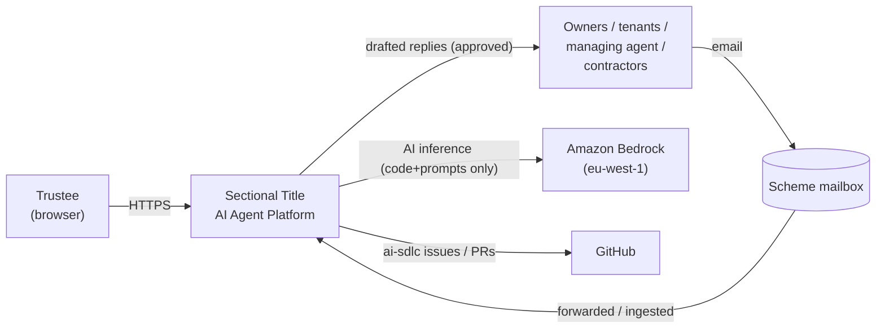
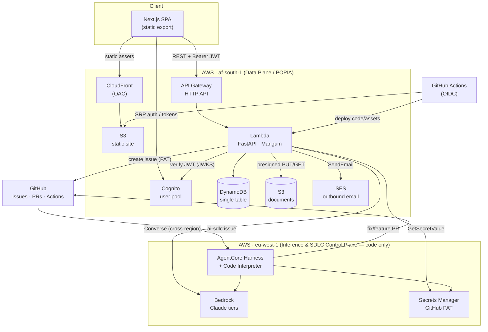
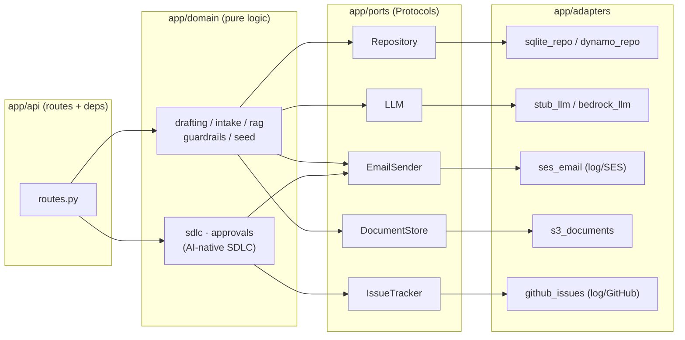
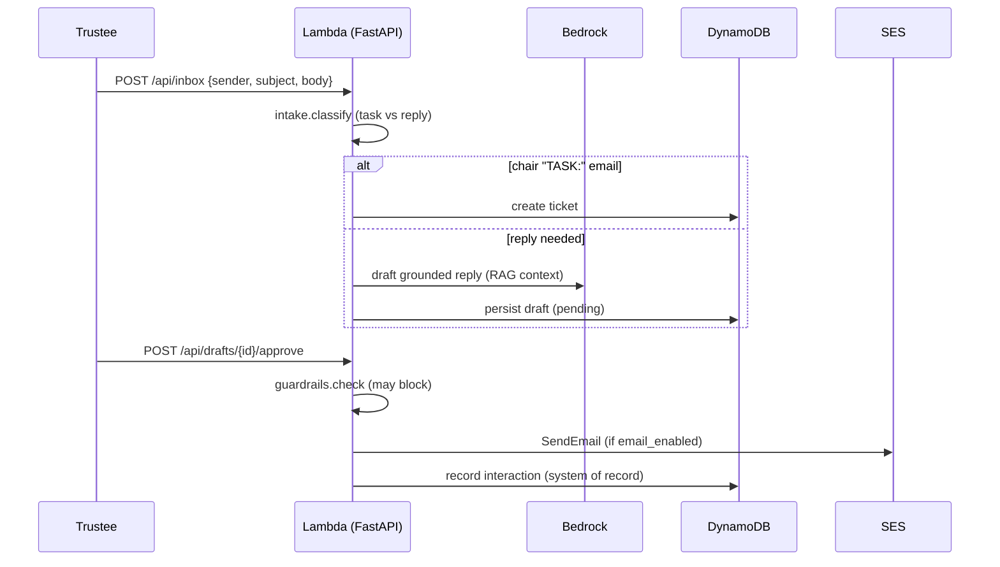

# Architecture Overview

> Sectional Title AI Agent Platform — an AI-native, serverless operations platform
> for South African body-corporate trustees, built on AWS with POPIA data
> residency. This document is the authoritative architecture reference; see
> [SOLUTION_DESIGN.md](SOLUTION_DESIGN.md) for product/UX detail and
> [AI_NATIVE_SDLC_OPERATING_MODEL.md](AI_NATIVE_SDLC_OPERATING_MODEL.md) for the
> self-developing delivery model.

An editable AWS-icon diagram is provided at
[architecture/stak-architecture.drawio](architecture/stak-architecture.drawio)
(open with [diagrams.net](https://app.diagrams.net)).

---

## 1. Context

Trustees run a sectional-title scheme as unpaid volunteers and are buried in
email, compliance deadlines, resolutions and maintenance coordination. The
platform is a **trustees-only** web application that triages inbound
correspondence, drafts grounded replies for human approval, and keeps a
defensible record — while every external party (owners, tenants, managing agent,
contractors, CSOS) continues to interact **by email only**.

Two design forces shape everything:

1. **POPIA data residency** — personal/financial data must stay in South Africa
   (`af-south-1`).
2. **A ≈ $50/month budget** — serverless, scale-to-zero, free-tier-first.



---

## 2. System context (C4 L1)

| Actor / System                             | Role                                                                                                                                |
| ------------------------------------------ | ----------------------------------------------------------------------------------------------------------------------------------- |
| **Trustee**                                | Authenticated SPA user; the only human with a login.                                                                                |
| **External parties**                       | Email-only correspondents (no platform access).                                                                                     |
| **Amazon Bedrock** (`eu-west-1`)           | Claude inference for classification, drafting, RAG answers. Receives **code + prompts only**, never resident personal data at rest. |
| **GitHub**                                 | Source of record for the AI-native SDLC: `ai-sdlc` issues and PRs.                                                                  |
| **Amazon Bedrock AgentCore** (`eu-west-1`) | Managed harness + code interpreter that turns `ai-sdlc` issues into pull requests.                                                  |

---

## 3. Containers (C4 L2)



### Container responsibilities

| Container                | Tech                        | Responsibility                                                                                                |
| ------------------------ | --------------------------- | ------------------------------------------------------------------------------------------------------------- |
| **SPA**                  | Next.js static export       | Trustee UI (inbox, board, resolutions, ask, documents, feature requests). Public `NEXT_PUBLIC_*` config only. |
| **CloudFront + S3**      | OAC, `PriceClass_100`       | Edge delivery of the static site; S3 origin is private (OAC-only).                                            |
| **Cognito**              | User pool + app client      | SRP auth, RS256 JWTs, forgot-password, `NEW_PASSWORD_REQUIRED` onboarding, optional TOTP MFA.                 |
| **API Gateway HTTP API** | Regional                    | Front door for the REST API; CORS; routes to Lambda.                                                          |
| **Lambda**               | Python 3.12, FastAPI/Mangum | The entire product API as one hexagonal app.                                                                  |
| **DynamoDB**             | Single table                | Durable store for documents, drafts, tickets, resolutions, interactions.                                      |
| **S3 (documents)**       | Private bucket              | Presigned-PUT uploads, server-side text extraction.                                                           |
| **SES**                  | Verified identity           | Outbound approved replies + SDLC approval magic-links.                                                        |
| **Bedrock**              | Claude Sonnet/Haiku/Opus    | Inference via eu-west-1 cross-region inference profiles.                                                      |
| **Secrets Manager**      | `stak/sdlc/github-pat`      | The GitHub PAT, read at boot by the Lambda and by the SDLC agent.                                             |
| **AgentCore Harness**    | Managed agent loop          | Reads `ai-sdlc` issues, edits code in a Code Interpreter sandbox, opens PRs.                                  |

---

## 4. Backend components (C4 L3) — hexagonal ports & adapters

The Lambda is a single FastAPI app organised as a hexagon: **domain** logic
depends only on **ports** (Protocols); **adapters** bind those ports to concrete
infrastructure, selected entirely by `STAK_*` environment configuration. The same
image therefore runs locally (SQLite + stub LLM + log email) and on AWS (DynamoDB

- Bedrock + SES) with no code change.



The **composition root** (`app/bootstrap.py`) is the only module that imports
concrete adapters; `app/main.py` wires them onto `app.state` during the Lambda
cold-start lifespan.

---

## 5. Key data flows

### 5.1 Inbound email → AI draft → human approval



### 5.2 Document upload (presigned S3) and RAG Q&A

Uploads use a **presigned PUT** so bytes go browser→S3 directly (the API never
streams payloads); on confirmation the API extracts text, chunks, and indexes it.
`/api/ask` retrieves the top chunks and asks Bedrock for a grounded answer with
cited sources.

### 5.3 AI-native SDLC control loop

```mermaid
sequenceDiagram
    participant FE as Frontend
    participant API as Lambda
    participant GH as GitHub
    participant AG as AgentCore Harness
    FE->>API: report-bug / feature-request
    Note over API: feature-request emails an HMAC magic-link;<br/>opening it authorises issue creation
    API->>GH: create ai-sdlc issue (PAT from Secrets Manager)
    GH->>AG: issue (label ai-sdlc)
    AG->>AG: clone, branch, minimal change, run tests (Code Interpreter)
    AG->>GH: open fix/feature PR
    GH->>GH: CI gates run; human approves at deploy boundary
```

---

## 6. Two-region design & rationale

| Region           | Plane                          | Why                                                                                                                                                                      |
| ---------------- | ------------------------------ | ------------------------------------------------------------------------------------------------------------------------------------------------------------------------ |
| **`af-south-1`** | Data plane                     | POPIA: all personal/financial data (Cognito, DynamoDB, SES, S3, the Lambda) stays in South Africa.                                                                       |
| **`eu-west-1`**  | Inference + SDLC control plane | The required Claude models / AgentCore are available here, not in af-south-1. Crosses the region boundary with **code and prompts only — never resident personal data**. |

Bedrock is reached from the af-south-1 Lambda via **cross-region inference
profiles** (`eu.anthropic.claude-*`). The GitHub PAT lives in eu-west-1 Secrets
Manager alongside the SDLC agent.

---

## 7. Security posture

- **Identity:** Cognito SRP; RS256 access tokens verified against the pool's JWKS;
  optional TOTP MFA; `STAK_AUTH_ENABLED` makes every route but `/api/health`
  require a valid token.
- **Edge:** CloudFront with Origin Access Control; the S3 site origin is private.
  Security headers + a strict CSP are set on responses.
- **Least-privilege IAM:** the Lambda execution role grants only what is enabled —
  DynamoDB (single table), Bedrock `InvokeModel` (scoped to Claude inference
  profiles) + the marketplace subscription actions, SES `SendEmail` (single
  identity, gated), S3 (uploads bucket, gated), and Secrets Manager
  `GetSecretValue` (the PAT secret, gated on `sdlc_enabled`). No `Resource: "*"`
  except where the AWS API forbids scoping.
- **Secrets:** never in code or env files — the GitHub PAT is read from Secrets
  Manager at boot; the SDLC approval HMAC key is generated by Terraform
  (`random_password`) and injected, never committed.
- **Policy-as-code:** Conftest/OPA enforces af-south-1-only, no public S3, no
  wildcard IAM, and SSM `SecureString` on every Terraform change.
- **Supply chain:** SBOM (Syft) + Grype, cosign keyless signing, SLSA provenance.

### Hardening opportunities (current gaps)

- **No customer VPC:** the Lambda runs outside a VPC. For stricter network
  isolation (private DynamoDB/S3 via VPC endpoints, egress control), move the
  Lambda into private subnets with gateway/interface endpoints.
- **SES sandbox:** production email delivery needs SES production access + a
  domain identity with DKIM (the current gmail from-address is sandbox-only).
- **AgentCore execution role** is currently broad (`bedrock-agentcore:*` on the
  account's eu-west-1 resources) to unblock the managed memory store; tighten to
  the specific memory/event/code-interpreter actions once stable.
- **Checkov** runs `soft_fail` during bootstrap; re-tighten after baseline triage.

---

## 8. Cost model (≈ $50 / month)

Defaults are **zero-spend** (stub LLM, log email, no S3/SDLC IAM). Live spend is
dominated by Bedrock inference at low volume; CloudFront/S3/Lambda/DynamoDB/Cognito
stay within free-tier for a single small scheme. A standing **AWS Budget**
(`stak-dev-monthly-50`) alerts at 80/100% actual and 100% forecast. The AgentCore
harness + code interpreter bill per session/invocation (minimal at idle).

---

## 9. Deployment & environments

Infrastructure is **Terraform/OpenTofu via Terragrunt** (`infra/live/dev/...`);
application code ships via **GitHub Actions over OIDC** (no stored keys). The
split is deliberate: workflows only update Lambda code / static assets, never
create or destroy infrastructure. Stacks: `bootstrap` (OIDC + deploy role) →
`app` (API/Lambda/DynamoDB/Cognito + optional SES/S3/SDLC) → `site`
(S3 + CloudFront).

---

## 10. Related ADRs

See [adr/](adr/) for the decision records (region split, minimal SDLC agent
roster, error contract, auto-approve model, and more) and
[AI_NATIVE_SDLC_OPERATING_MODEL.md](AI_NATIVE_SDLC_OPERATING_MODEL.md) for the
delivery model that governs this repository's own evolution.
